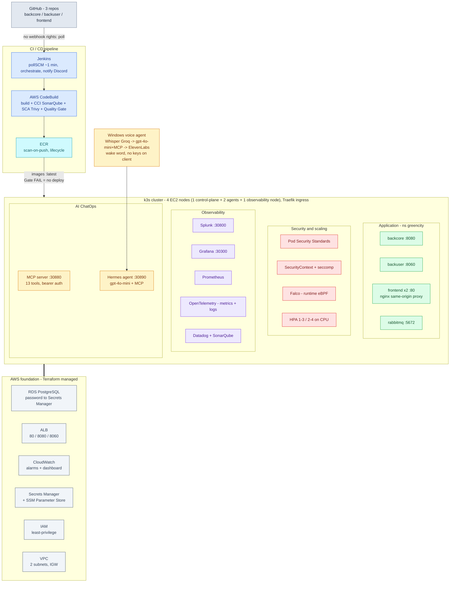

# GreenCity — Architecture

Full diagram of the platform. GitHub renders the Mermaid block below inline.

## How it flows

1. **Source → CI:** programmers push to GitHub. We have no webhook rights, so **Jenkins polls**
   the repos (`pollSCM`) and triggers **CodeBuild**.
2. **Build & gate:** CodeBuild builds the three images and runs **SonarQube (CCI)** + **Trivy
   (SCA)**. A blocking **Quality Gate** stops the pipeline on new bugs/vulnerabilities — a failed
   gate means **no deploy**.
3. **Registry → deploy:** images land in **ECR** (scanned on push); k3s pulls `:latest`.
4. **Cluster:** the app runs in namespace `greencity`, guarded by **PSS + SecurityContext + Falco**
   and scaled by **HPA**. Six observability tools and the **MCP + Hermes ChatOps** stack run on a
   dedicated 8 GB node.
5. **Foundation:** everything sits on Terraform-managed AWS — **VPC, RDS (password in Secrets
   Manager), ALB, CloudWatch, IAM, SSM**.
6. **Voice:** a Windows tray assistant turns speech into cluster operations
   (**Whisper → gpt-4o-mini + MCP tools → ElevenLabs**).

See [README.md](README.md) for the component detail and [DECISIONS.md](DECISIONS.md) for the
"why" behind every choice.
